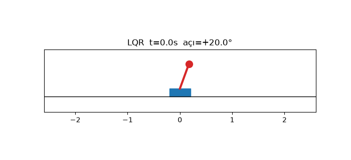
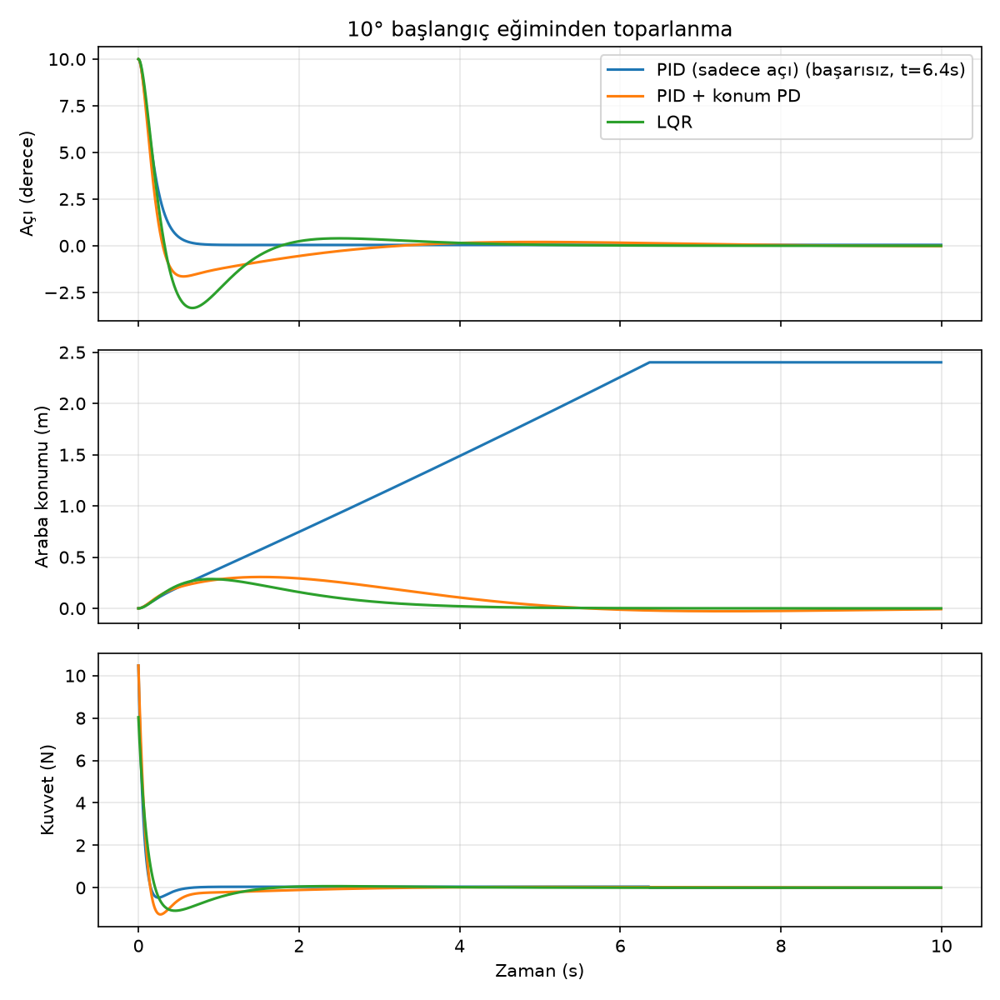
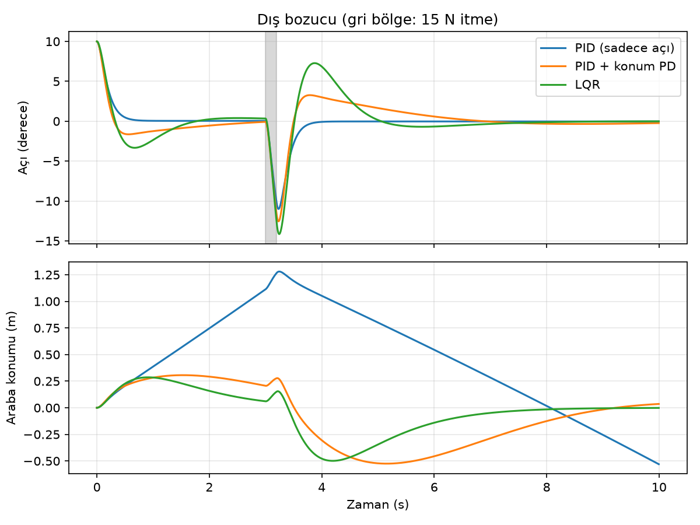
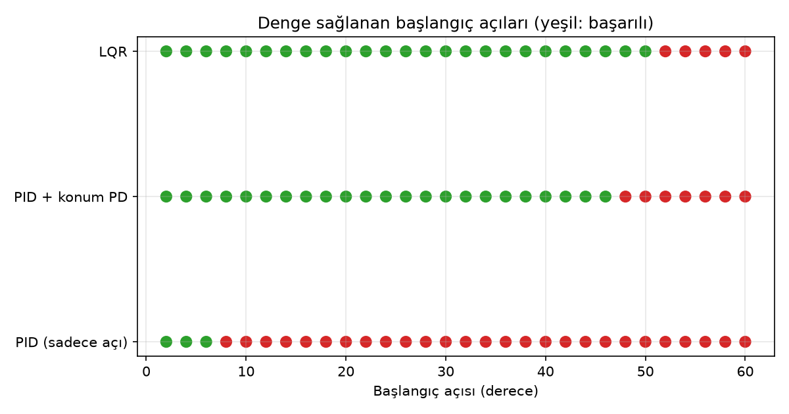
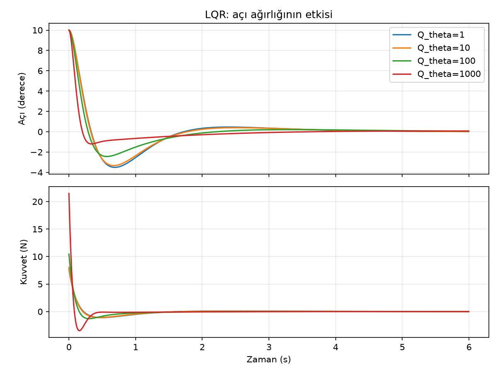

# Cart-Pole Denge Kontrolü: PID ve LQR

Ters sarkaç (cart-pole) sisteminin **doğrusal olmayan** fiziğini sıfırdan (NumPy, RK4) simüle edip
çubuğu dik tutmak için üç denetleyiciyi karşılaştırdım. Humanoid ve ayaklı robotlardaki denge
kontrolünün en basit modelidir: dengesiz bir sistemi geri besleme ile ayakta tutmak.



## Model
- Durum: `[x, x_dot, theta, theta_dot]`, giriş: arabaya uygulanan yatay kuvvet `u`
- Doğrusal olmayan hareket denklemleri `src/dynamics.py` içinde, `theta = 0` civarında doğrusallaştırılmış
  `A, B` matrisleri LQR için kullanıldı
- Gerçekçilik için: kuvvet doygunluğu (±30 N), ray sınırı (|x| < 2.4 m), araba sürtünmesi, geçici dış itme

## Denetleyiciler
| Denetleyici | Fikir |
|---|---|
| **PID (sadece açı)** | `u = Kp·θ + Kd·θ̇` |
| **PID + konum PD** | Açı PID'ine araba konumu ve hızı için PD terimleri eklendi |
| **LQR** | Riccati denklemi ile `u = -K·s`; `Q = diag(1,1,10,1)`, `R = 0.1` |

## Sonuçlar
**1. Aynı başlangıçtan (10° eğim) toparlanma**



Sadece açıya bakan PID çubuğu hızla dik tutuyor ama araba sürekli bir yöne kayıyor ve ~6.4 s'de
raydan çıkıyor. Konum bilgisi (PID + konum PD veya LQR) bu sorunu çözüyor. Sebep: açıdan gelen
geri besleme araba konumunu hiç görmediği için konum kontrol edilmeyen bir mod olarak kalıyor.

**2. Dış bozucu (3. saniyede 15 N, 0.2 s itme)**



**3. Başlangıç açısı taraması (2°–60°)**



| Denetleyici | En büyük başarılı başlangıç açısı | Başarılı deneme |
|---|---|---|
| PID (sadece açı) | 6° | 3/30 |
| PID + konum PD | 46° | 23/30 |
| LQR | 50° | 25/30 |

Başarı kriteri: çubuk devrilmez (|θ| < 90°), araba raydan çıkmaz ve 10 s sonunda |θ| < 0.02 rad.
Bu sınırlar doğrusallaştırmanın tek başına öngöreceği küçük açılardan çok daha geniş; yine de büyük
açılarda kuvvet doygunluğu ve doğrusal olmayan etkiler belirleyici oluyor.

**4. LQR ağırlık ayarı (`Q_theta`)**



`Q_theta` büyüdükçe açı daha agresif düzeltiliyor ama gereken kuvvet de artıyor
(`Q_theta=1`: ~7.7 N, `Q_theta=1000`: ~21.5 N).

## Çalıştırma
```bash
pip install -r requirements.txt
python src/run_experiments.py   # grafikleri üretir ve tabloyu yazdırır
python src/animate.py           # GIF üretir
```

## Sınırlılıklar
- Tam durum ölçümü varsayıldı (gürültü ve durum kestirimi yok)
- PID kazançları elle ayarlandı, otomatik optimizasyon yok
- Sürtünme sadece arabada; çubuk mafsalı sürtünmesiz
- Sonraki adım: ölçüm gürültüsü + Kalman filtresi, swing-up (aşağıdan kaldırma) denetleyicisi
